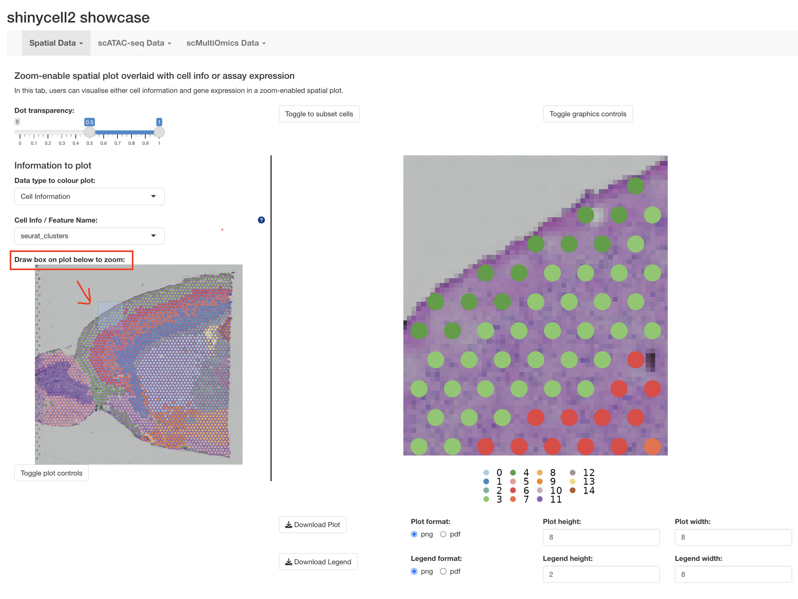
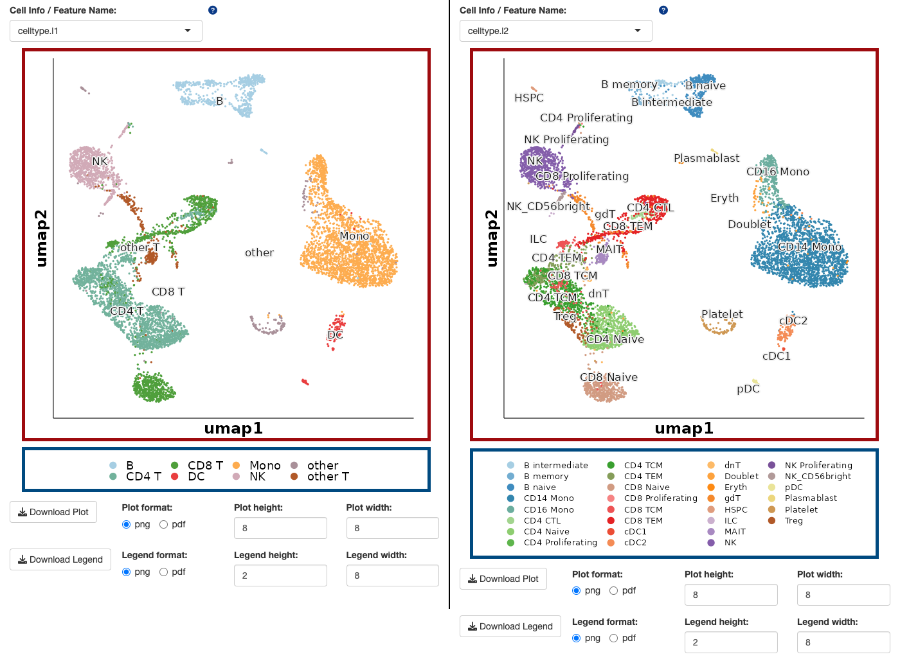
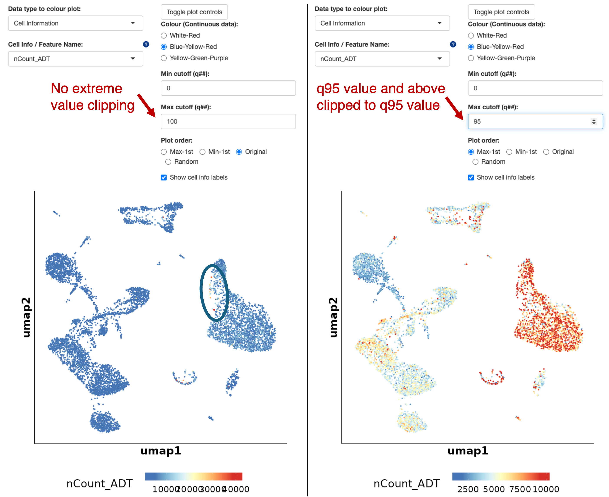
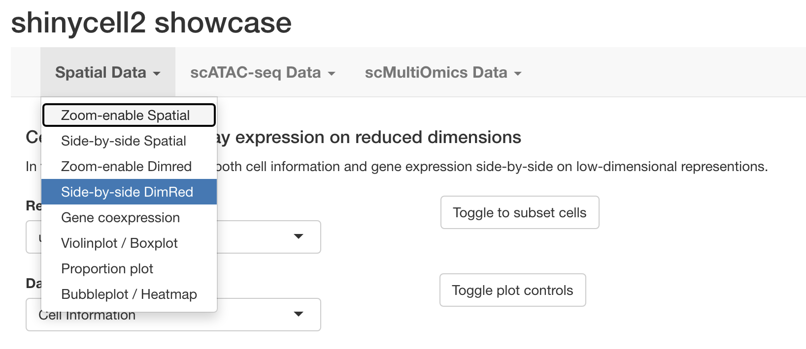
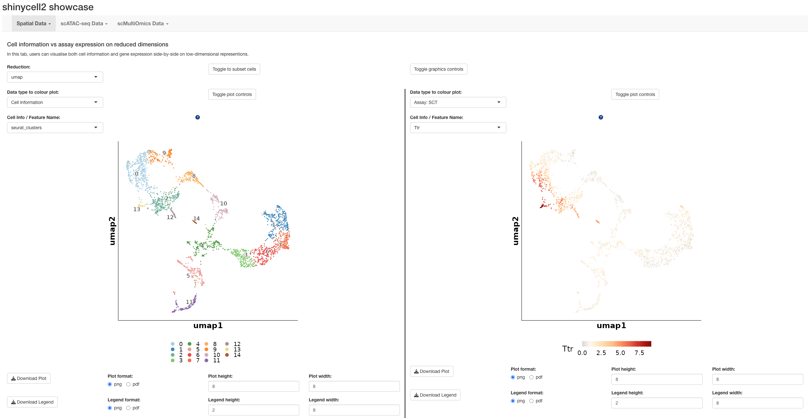
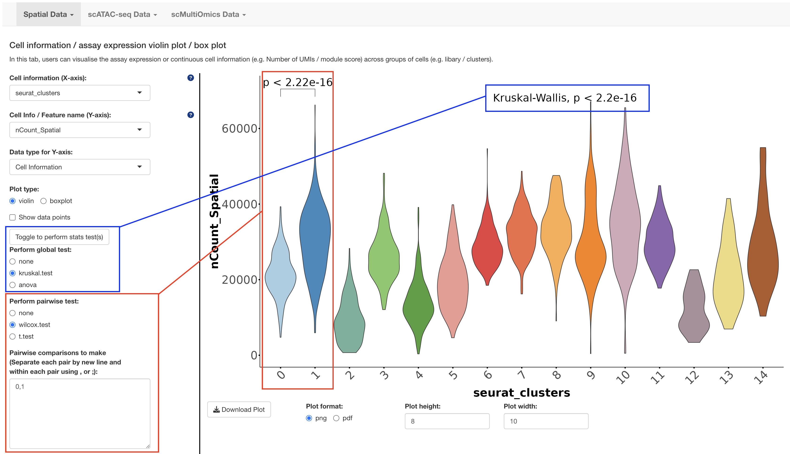
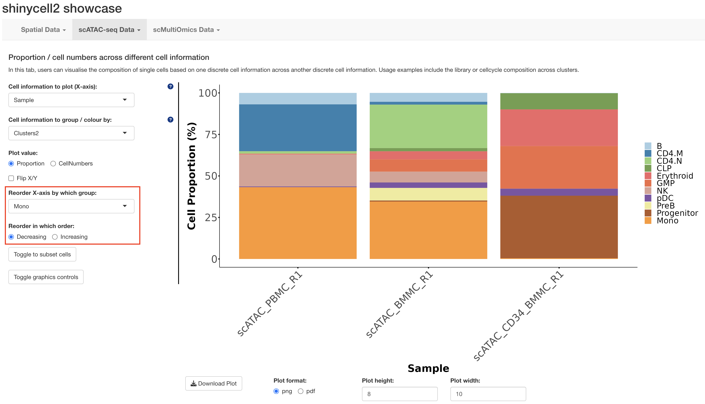
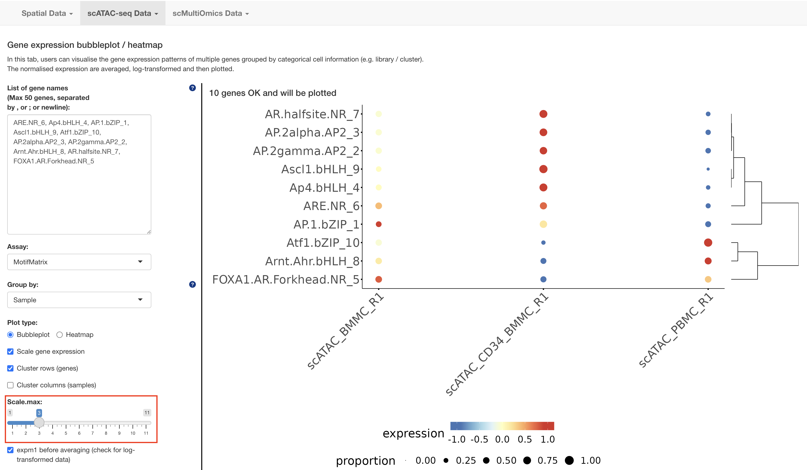

# Introduction
This page showcase seven new features of enhanced visualization with ShinyCell2, 
outlined below. Please refer to the corresponding section for more detailed 
explanations of the features and the visual examples for demonstrations.

1. Zoom-enabled UMAP
2. Separate Legend Rendering
3. Extreme Value Handling
4. Side-by-side Visualization
5. Statistical Testing on Violin/Box Plots
6. Flexible Ordering on Proportion Plots
7. Customized Color Scale on Bubble Plot/Heatmap

# 1. Zoom-enabled UMAP
For single-cell analysis, researchers are often interested in examining a 
specific region of the UMAP. The current enhanced feature enables users to zoom 
into a particular region of UMAP without loss of resolution. At the same time, a 
global and a local perspective of the UMAP is displayed simultaneously with 
dynamic displays of cell counts in both the full and zoomed-in views.

# 2. Separate Legend Rendering
To provide users with easy image post-processing, this current enhanced feature 
allows users to export main plots and legends as separate PNG or PDF files.
More importantly, this feature ensures that the main plots (boxed red below) are 
always of the same consistent sizing regardless of the size of the legends 
(boxed blue below).

# 3. Extreme Value Handling
It is not uncommon to have extreme values i.e. outliers in the data that distort 
the color scale of the display, making it hard to interpret the inflated color 
range. This enhanced feature applies a percentile-based minimum and maximum 
cutoffs, effectively minimizing the influence of outliers and enhancing the 
clarity of color-based data representations. Here, we show an example below 
where there are some outlier values (circled blue on the left panel). After 
applying a q95 max cutoff (right panel), the updated colour scale better 
reflects the data distribution.

# 4. Side-by-side Visualization
In order to facilitate comparison across modalities, for example, simultaneously 
examining cell metadata and assay expressions, we set up both the 
"**Side-by-side Spatial**" and "**Side-by-side DimRed**" tabs where users can 
display the relevant information of interest in a side-by-side manner. 
Additional example includes display of confusion matrices to compare cell 
memberships between categorical variable pairs or scatter plots with correlation 
statistics for continuous variables. 

# 5. Statistical Testing on Violin/Box Plots
Statistical testing has been implemented in this enhanced feature, supporting 
both global (kruskal-wallis or anova) and pairwise (wilcoxon or t.test) 
comparisons across groups in the "**Violin / Boxplot**" tab. Users can directly 
draw robust statistical conclusions within the app. 

# 6. Flexible Ordering on Proportion Plots
The "**Proportion plot**" tab now allows flexible ordering of the X-axis. Users 
can sort the groups/samples by cell proportions, making it easier to identify 
clusters that are dominated by cells from specific biological or experimental 
conditions. 

# 7. Customized Color Scale on Bubble Plot/Heatmap
The final enhanced feature offers customizable color scale in the 
"**Bubbleplot / Heatmap**" tab, through max value clipping. Users can now drag 
teh slider to adjust the dynamic range of the visualization and highlight the 
relevant data patterns.

--- THE END ---\
Thank you for reading this tutorial :)