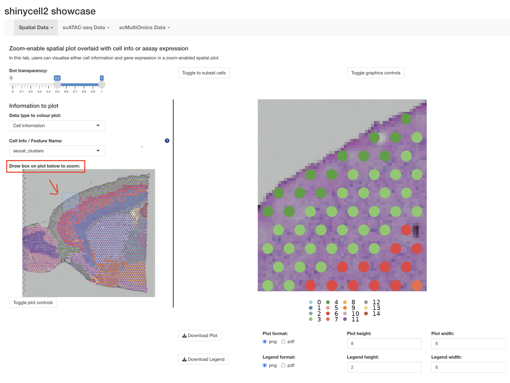
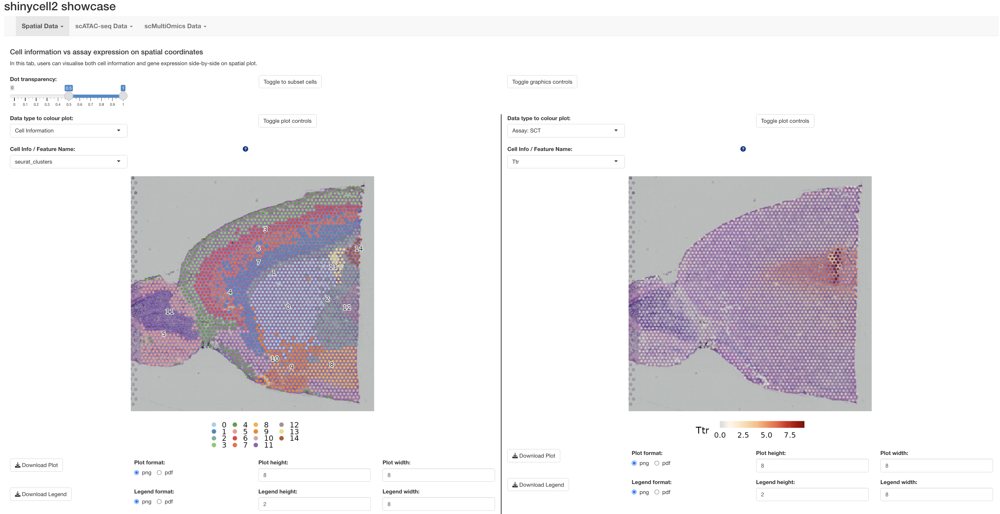
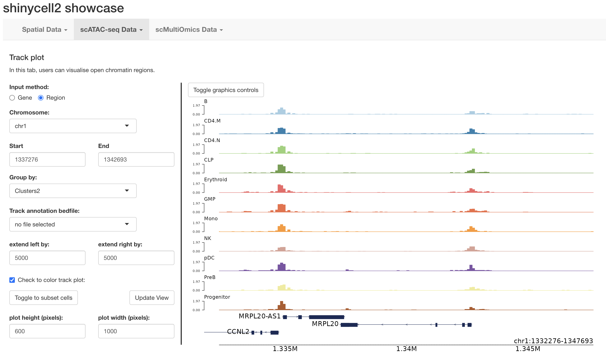
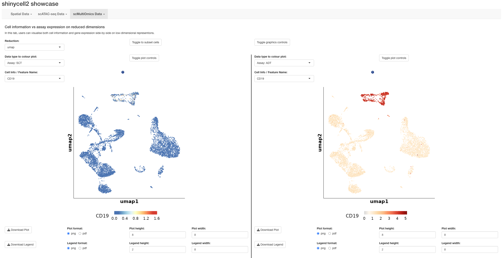
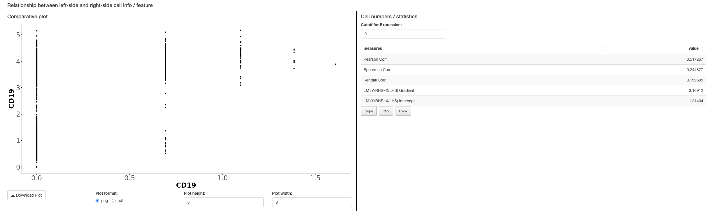

# Introduction

This page showcase visualisations of **spatial Transcriptomics**, 
**scATAC-seq Track Plot**, and **Multi-omics Visualisation**
with ShinyCell2. Please refer to the corresponding session for more detailed 
explanations of the features and the visual examples for demonstrations.

# Spatial Transcriptomics

## S1. Zoom-enabled Plots
This view is for detailed exploration of spatial gene expression with metadata 
overlaid, allowing users to focus on specific regions of the tissue images.

🧭 Step-by-Step Guide\

- Open the "Zoom-enabled Spatial" tab.\
- Draw a box on the region of interest.\
- Zoomed-in view of specific regions of the tissue image displayed for 
  inspection of fine-grained spatial patterns.\

🚀 How It Works\

This tab uses a zooming feature powered by restricting the viewpoint of a 
ggplot2 object. This technique allows:\

- High responsiveness\
- No loss of image resolution\
- Smooth and fast navigation through detailed tissue sections.\

## S2. Side-by-side Plots
Use this view when you want to compare different data types directly within the 
spatial tissue context.

🧭 Step-by-Step Guide\

- Open the "Side-by-side Spatial" tab.\
- Select two layers of information to display side-by-side:

For example, one can compare cell type annotations with gene expression 
patterns (see below). This layout helps in understanding how gene expression 
relates to specific cell types within the tissue architecture. 

With these tools, you can intuitively explore spatial transcriptomics data, 
uncovering detailed spatial patterns and relationships in your tissue samples.

# scATAC-seq Track Plot 
ShinyCell2 makes it easy to visualize scATAC-seq data using *IGV-style* locus 
plots powered by the *Trackplot* function.

🧭 Step-by-Step Guide\

- Open the Trackplot tab in scATAC-Seq Data of ShinyCell2\
- Specify a region of interest using either:\
-- A gene name, or \
-- Genomic coordinates (e.g., chr1:1337276-1342693).\

Optionally add annotation tracks (e.g., ENCODE cis-regulatory elements) in 
standard BED format for extra context.

🚀 How It Works\
Trackplot uses *bwtool* (a fast bigWig query tool) and data.table in R for 
performance. It extracts open chromatin signals directly from bigWig files, 
making it over 15× faster than typical plotting tools, and ideal for large 
datasets or plotting multiple regions.

With this setup, we can achieve fast, flexible, and informative chromatin 
accessibility visualizations, enriched with regulatory annotations.

# Multi-omics Visualisation
ShinyCell2 makes it easy to explore multi-omics single-cell data—including RNA, 
protein, and chromatin accessibility—within a single interface.

🧭 Step-by-Step Guide\

- Generate a ShinyCell2 app using multi-assay dataset e.g CITE-seq.\
- Switch between assays such as: RNA expression, protein abundance, chromatin accessibility\
- Use interactive UMAPs to visualize and compare profiles from each molecular layer.\
- Select features (genes, proteins, peaks) from any assay to explore patterns across cell populations.\
- Compare cell type annotations across data types to assess consistency and identify regulatory mechanisms.\

🚀  Why It’s Powerful\

- Provides integrated multi-omics view of single cells.\
- Explore cellular heterogeneity across different molecular layers.\
- Identify how RNA, protein, and chromatin data converge or differ in defining 
cell states.\

This unified approach gives you a more comprehensive view and understanding of 
your single-cell data.\

--- THE END ---\
Thank you for reading this tutorial :)