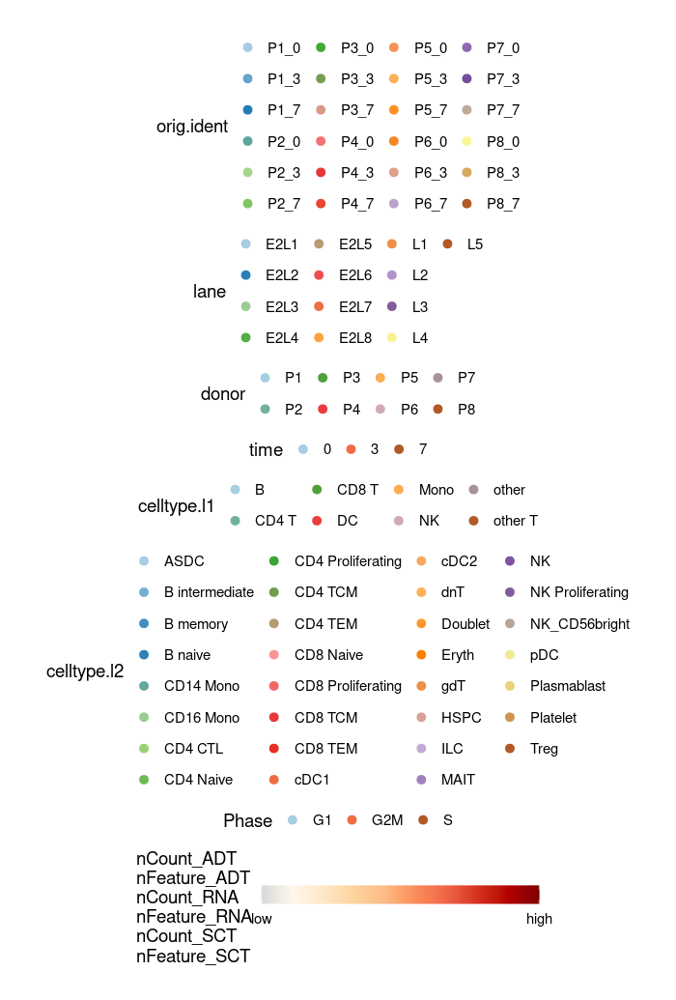
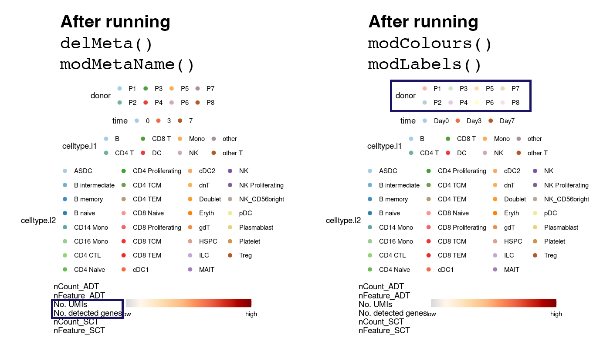
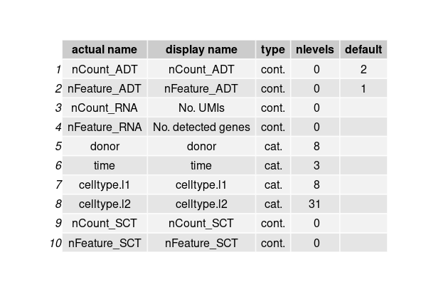
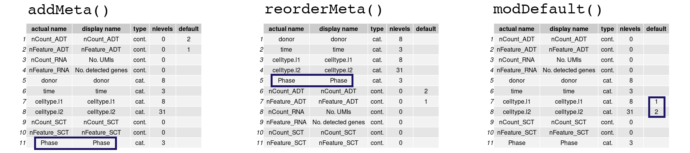

Here, we present a detailed walkthrough on how `ShinyCell2` can be used to 
create a Shiny app from single-cell data objects. In particular, we will focus 
on how users can customise what metadata is to be included, their labels and 
colour palettes. To demonstrate, we will use the PBMC single-cell CITE-seq data, 
the same Seurat object used in the **Quick-start Guide**. The Seurat object can 
be [downloaded here](
https://zenodo.org/records/15162323/files/multimodal_pbmc.rds?download=1).


# Load data and create ShinyCell configuration
First, we will load the Seurat object and run `createConfig()` to create a 
ShinyCell configuration `scConf`. The `scConf` is a data.table containing (i) 
the single-cell metadata to display on the Shiny app, (ii) ordering of factors 
/ categories for categorical metadata e.g. library / cluster and (iii) colour 
palette associated with each metadata. Thus, `scConf` acts as an "instruction 
manual" to build the Shiny app without modifying the original single-cell data.

``` r
library(Seurat)
library(ShinyCell2)
library(RColorBrewer)

seu <- readRDS("testing/multimodal_pbmc.rds")
scConf <- createConfig(seu)
```

To visualise the contents of the Shiny app prior to building the actual app, 
we can run `showLegend()` to display the legends associated with all the 
single-cell metadata. This allows users to visually inspect which metadata to 
be shown on the Shiny app. This is useful for identifying repetitive metadata 
and checking how factors / categories for categorical metadata will look in 
the eventual Shiny app. Categorical metadata and colour palettes are shown 
first, followed by continuous metadata which are shown collectively. 

``` r
showLegend(scConf)
```




# Add / remove / modify metadata and colour palette
It is possible to modify `scConf` directly but this might be prone to error. 
Thus, we provided numerous convenience functions to modify `scConf` and 
ultimately the Shiny app. In this example, we note that the `orig.ident`,
`lane` and `Phase` metadata are excessive and to remove them. To exclude 
metadata from the Shiny app, we can run `delMeta()`. Furthermore, we can modify 
how the names of metadata appear by running `modMetaName()`. 

By default, colours for categorical metadata are generated by interpolating 
colours from the "Paired" colour palette in the RColorBrewer package. To 
modify the colour palette, we can run `modColours()`. Here, we changed the 
colours for the `donor` metadata. It is also possible to modify the labels for 
each category via `modLabels()`. For example, we changed the labels of the 
`time` metadata to append the prefix word "day". After modifying `scConf`, it is 
recommended to run `showLegend()` to inspect the changes made.

``` r
# Delete excessive metadata and rename some metadata
scConf = delMeta(scConf, c("orig.ident", "lane", "Phase"))
scConf = modMetaName(scConf, 
                     meta.to.mod = c("nCount_RNA", "nFeature_RNA"), 
                     new.name = c("No. UMIs", "No. detected genes"))
showLegend(scConf)

# Modify colours and labels
scConf = modColours(scConf, meta.to.mod = "donor", 
                    new.colours= brewer.pal(8,"Pastel1"))
scConf = modLabels(scConf, meta.to.mod = "time", 
                   new.labels = c("Day0", "Day3", "Day7"))
showLegend(scConf)
```




# Change order of appearance of metadata and defaults
Apart from `showLegend()`, users can also run `showOrder()` to display the 
order in which metadata will appear in the dropdown menu when selecting which 
metadata to plot in the Shiny app. A table will be printed showing the actual 
name of the metadata in the single-cell object and the display name in the 
Shiny app. The metadata type (either categorical or continuous) is also 
provided with the number of categories "nlevels". Finally, the "default" 
column indicates which metadata are the primary and secondary default.

``` r
showOrder(scConf)
```



Here, we introduce a few more functions that might be useful in modifying the 
Shiny app. Users can add metadata back via `addMeta()`. The newly added 
metadata (in this case, the phase metadata) is appended to the bottom of the 
list as shown by `showOrder()`. Next, we can reorder the order in which 
metadata appear in the dropdown menu in the Shiny app via `reorderMeta()`. 
Here, we shifted the phase metadata up the list. Finally, users can change the 
default metadata to plot via `modDefault()`. Again, it is recommended to run 
`showOrder()` frequently to check how the metadata is changed.

``` r
# Add metadata back, reorder, default
scConf = addMeta(scConf, "Phase", seu) 
showOrder(scConf)
scConf = reorderMeta(scConf, scConf$ID[c(5:8,11,1:4,9:10)])
showOrder(scConf)
scConf = modDefault(scConf, "celltype.l1", "celltype.l2")
showOrder(scConf)
```




# Generate Shiny app
After modifying `scConf` to one's satisfaction, we are finally build the Shiny 
app. Prior to building the Shiny app, users can run `checkConfig()` to check if 
the `scConf` is in the right format. This is especially useful if users have 
manually modified the `scConf`. 

``` r
checkConfig(scConf, seu)
```

Now, we can build the shiny app using `makeShinyFiles()` and `makeShinyCodes()` 
functions. A few more things can be specified here. Specifically, the 
`makeShinyFiles()` function can take in the following arguments, namely 
`dimred.to.use`, `default.gene1`, `default.gene2`, `default.multigene` and 
`default.dimred`. `default.gene1` and `default.gene2` specifies the default 
genes when plotting gene expression on reduced dimensions while 
`default.multigene` contains the default set of multiple genes when plotting 
bubbleplots or heatmaps. If unspecified, `ShinyCell2` will automatically select 
highly variable genes present in the dataset as default genes. `dimred.to.use` 
specifies the reduced dimensions to be included in the Shiny app while 
`default.dimred` specifies the default to be plotted.

``` r
makeShinyFiles(seu, scConf, shiny.prefix = "sc1", 
               dimred.to.use = c("umap","aumap","wnn.umap"),
               default.gene1 = "CD19", default.gene2 = "IRF1", 
               shiny.dir = "shinyApp/")
makeShinyCodes(shiny.title = "PBMC CITE-seq", shiny.prefix = "sc1", 
               shiny.dir = "shinyApp/")
```


