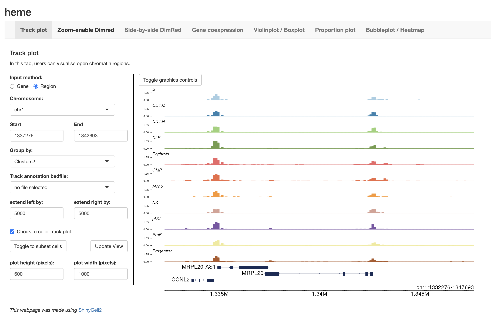

# Introduction
This tutorial guides users on how to create a ShinyCell2 app from a single-cell 
ATAC-seq (scATAC-seq) dataset processed using the ArchR pipeline. ArchR is an R 
package tailored for analysing open chromatin regions, enabling single-cell 
level insights into gene regulation. ArchR stores HDF5-backed matrices, 
metadata, peak/gene annotations, clustering results, plots, arrow and bigWig 
files into a project directory. Arrow files are custom, compressed HDF5-based 
files that efficiently store single-cell ATAC-seq data and support fast data 
access. bigWig files store continuous genomic signal tracks (e.g., chromatin 
accessibility), and are used for visualisation in genome browsers. The key file 
`Save-ArchR-Project.rds` saves the entire ArchR project, including processed 
data and results, for easy reloading.

In this tutorial, we will be using a down-sampled haematopoietic cell dataset 
from Granja* et al. (Nature Biotechnology, 2019), comprising bone marrow 
mononuclear cells (BMMCs), peripheral blood mononuclear cells (PBMCs), and 
CD34+ stem/progenitor cells isolated from bone marrow (CD34+ BMMCs). The 
scATAC-seq dataset is available as a compressed project directory that can be 
downloaded as `ArchR-ProjHeme.tar.gz` in this 
[Zenodo repository](https://zenodo.org/records/15162323).

## Importing ArchR-processed scATAC-seq data into ShinyCell2
To begin, we will load the ArchR package and import an ArchR project from the 
folder `ArchR-ProjHeme` into R. The project is stored in the variable 
`archr_obj` for downstream use.

``` r
library(ArchR)
archr_obj <- loadArchRProject(path = "ArchR-ProjHeme") 
```

# Configuring ShinyCell2 for optimal visualisation of scATAC-seq data
Next, we will use the `createConfig()` function to generate a ShinyCell2 config 
object named `scConf`. This object is a data.table that specifies: (i) which 
single-cell metadata to display in the Shiny app, (ii) the ordering of levels 
for categorical metadata (e.g., library or cluster), and (iii) the color palette 
assigned to each metadata variable. Essentially, scConf serves as an 
"instruction manual"" for defining the aesthetics of the eventual ShinyCell2 
app, without altering the original single-cell data. Here, we removed some 
metadata that we deem redundant using the delMeta() function. For more details 
on how to customise the ShinyCell2 config, refer to this 
[Tutorial for customising ShinyCell aesthetics](
https://htmlpreview.github.io/?https://github.com/the-ouyang-lab/ShinyCell2-tutorial/master/docs/aesthetics.html)

``` r
library(ShinyCell2)
scConf <- createConfig(archr_obj)

# Remove metadata columns that contain minimal or redundant information
scConf <- delMeta(scConf, c("ReadsInTSS", "ReadsInPromoter", "ReadsInBlacklist",
                            "NucleosomeRatio", "nMultiFrags", "nMonoFrags", 
                            "nFrags", "nDiFrags", "ReadsInPeaks")) 
```

# Create Shiny Files
To generate the ShinyCell2 app, we first run the `makeShinyFiles()` function. 
This wrapper function generates the necessary data files (including the 
single-cell metadata and assay etc). The main inputs are the ArchR object, the 
ShinyCell2 config `scConf`, an unique prefix for the dataset specified by 
`shiny.prefix = "sc1"` and the output directory `shiny.dir`. For scATAC-seq 
data, an additional `bigWigGroup` parameter specifies which categorical 
grouping(s) in the ArchR project's metadata should be used to group cells for 
the generation of BigWig files. These files are used in the ShinyCell2 app to 
display track plots visualisations showing chromatin accessibility across the 
cell populations. Users can also specify the reduced dimensions to include as 
well as plotting defaults. Further visualisation parameters include 
`default.gene1 = "IRF1"` and `default.gene2 = "GATA2"` specify the default genes 
that will be displayed in the gene activity panel when the ShinyCell2 app loads. 
Note that this step can take a substantial amount of time to run as the whole 
dataset is being written in an efficient format for the ShinyCell2 app. 

``` r
makeShinyFiles(archr_obj, scConf = scConf, dimred.to.use = "UMAP", 
     bigWigGroup = c("Clusters2", "predictedGroup"), shiny.prefix = "sc1",
     shiny.dir = "shinyApp_heme/", 
     default.gene1 = "IRF1", default.gene2 = "GATA2", chunkSize = 500)
```

# Generate code for Shiny app
Finally, we will generate the code for the ShinyCell2 app using the 
`makeShinyCodes()` function. Here, we specify the same unique prefix 
`shiny.prefix = "sc1"` and output directory shiny.dir. This step should run 
quickly as only the R code scripts are being written.

``` r
makeShinyCodes(shiny.prefix = "sc1", 
               shiny.dir = "./shinyApp_heme/", 
               shiny.title = "scATAC-seq")
```

The generated shiny app can then be found in the `shinyApp_heme/"` folder. To 
run the app locally, use RStudio to open either server.R or ui.R in the shiny 
app folder and click on “Run App” in the top right corner. The shiny app can 
also be deployed online via online platforms e.g. shinyapps.io and Amazon Web 
Services (AWS) or be hosted via Shiny Server. For further details, refer to 
Instructions on how to deploy ShinyCell apps online. More details on the various 
visualisations in the ShinyCell2 can be found in 
[Additional information on new visualisations tailored for spatial / scATAC-seq / multiomics](
https://htmlpreview.github.io/?https://github.com/the-ouyang-lab/ShinyCell2-tutorial/master/docs/addNewVis.html) and 
[Additional information on enhanced visualisation features](
https://htmlpreview.github.io/?https://github.com/the-ouyang-lab/ShinyCell2-tutorial/master/docs/addEnhanVis.html)




