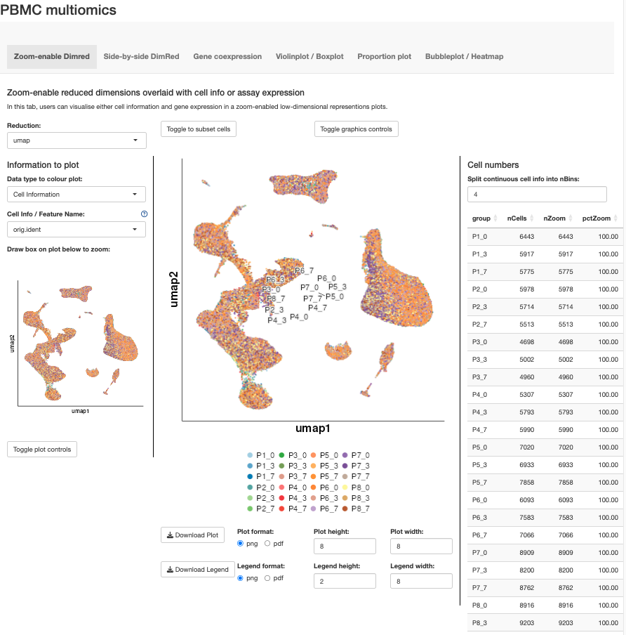

# Introduction
This tutorial guides users on how to create a ShinyCell2 app from standard 
single-cell RNA sequencing (scRNA-seq) and multiomics datasets (e.g., CITE-seq) 
processed using the Seurat or scanpy pipeline. The eventual output will be a
sharable web app that allows for dynamic data exploration.

In this tutorial, we will be using the publicly available PBMC CITE-seq dataset 
from the Satija Lab contains 161,764 cells from 8 volunteers in an HIV vaccine 
trial, measured at 3 time points, resulting in 24 distinct libraries. The 
CITE-seq assay combines scRNA-seq with antibody-based protein measurements, 
providing a comprehensive view of cellular heterogeneity. This also allows us to 
showcase the ShinyCell2 app's ability to simultaneously visualise gene 
expression and protein abundance information from such multiomics dataset. The 
CITE-seq dataset is available as a Seurat object that can be downloaded as 
`multimodal_pbmc.rds` in this [Zenodo repository](https://zenodo.org/records/15162323).

# Importing Seurat-based scRNA-seq or CITE-seq data into ShinyCell2
To begin, we will load the required packages and the processed Seurat object: 

``` r
library(Seurat)
library(ShinyCell2)

seu <- readRDS("multimodal_pbmc.rds")
```

# Configuring ShinyCell2 for optimal visualisation
Next, we will use the `createConfig()` function to generate a ShinyCell2 config 
object named `scConf`. This object is a `data.table` that specifies: (i) which 
single-cell metadata to display in the Shiny app, (ii) the ordering of levels 
for categorical metadata (e.g., library or cluster), and (iii) the color palette 
assigned to each metadata variable. Essentially, `scConf` serves as an 
"instruction manual" for defining the aesthetics of the eventual ShinyCell2 app, 
without altering the original single-cell data. Here, we removed some metadata 
that we deem redundant using the `delMeta()` function. For more details on how 
to customise the ShinyCell2 config, refer to this [Tutorial for customising ShinyCell aesthetics](
https://htmlpreview.github.io/?https://github.com/the-ouyang-lab/ShinyCell2-tutorial/master/docs/aesthetics.html)

``` r
scConf <- createConfig(seu)
scConf <- delMeta(scConf, "lane")
```

# Create Shiny Files
To generate the ShinyCell2 app, we first run the `makeShinyFiles()` function. 
This function generates the necessary data files (including the single-cell 
metadata and assay etc). The main inputs are the Seurat object `seu`, the 
ShinyCell2 config `scConf`, an unique prefix for the dataset specified by 
`shiny.prefix = "sc1"` and the output directory `shiny.dir`. Users can also 
specify the reduced dimensions to include as well as plotting defaults. Note 
that this step can take a substantial amount of time to run as the whole 
dataset is being written in an efficient format for the ShinyCell2 app.

``` r
makeShinyFiles(seu, scConf = scConf, dimred.to.use = "umap", 
    shiny.prefix = "sc1", shiny.dir = "shinyApp_CITE-seq/", 
    default.gene1 = "IRF1", default.gene2 = "GATA2")
```

# Generate code for Shiny app
Finally, we will generate the code for the ShinyCell2 app using the 
`makeShinyCodes()` function. Here, we specify the same unique prefix 
`shiny.prefix = "sc1"` and output directory `shiny.dir`. This step should run 
quickly as only the R code scripts are being written.

``` r
makeShinyCodes(shiny.prefix = "sc1", 
               shiny.dir = "shinyApp_CITE-seq/", 
               shiny.title = "pbmc_CITE-seq")
```

The generated shiny app can then be found in the `shinyApp_CITE-seq/` folder. 
To run the app locally, use RStudio to open either 
`server.R` or `ui.R` in the shiny app folder and click on "Run App" in the top 
right corner. The shiny app can also be deployed online via online platforms 
e.g. [shinyapps.io](https://www.shinyapps.io/) and Amazon Web Services (AWS) 
or be hosted via Shiny Server. For further details, refer to 
[Instructions on how to deploy ShinyCell apps online](
https://htmlpreview.github.io/?https://github.com/the-ouyang-lab/ShinyCell2-tutorial/master/docs/cloud.html).

More details on the various visualisations in the `ShinyCell2` can be found in
[Additional information on new visualisations tailored for spatial / scATAC-seq / multiomics](
https://htmlpreview.github.io/?https://github.com/the-ouyang-lab/ShinyCell2-tutorial/master/docs/addNewVis.html)
and [Additional information on enhanced visualisation features](
https://htmlpreview.github.io/?https://github.com/the-ouyang-lab/ShinyCell2-tutorial/master/docs/addEnhanVis.html)




