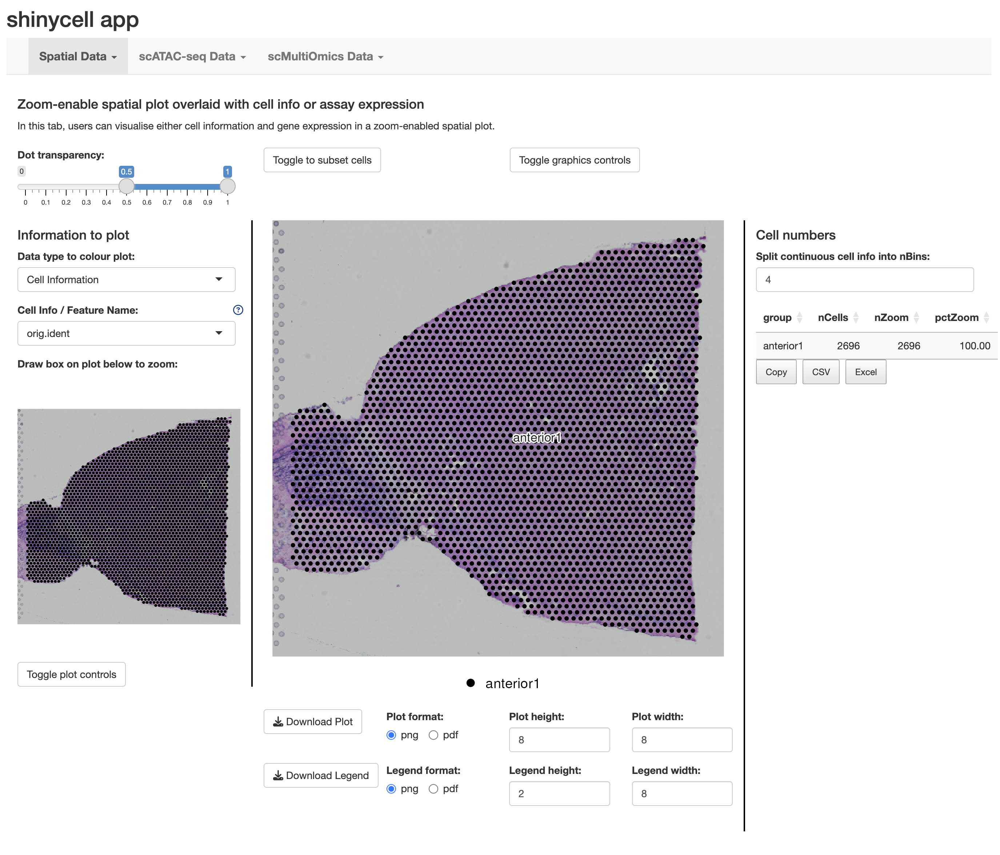

# Introduction
This tutorial guides users on how to create a ShinyCell2 app that facilitates 
the exploration of multimodal single-cell data, integrating spatial 
transcriptomics, scATAC-seq and scRNA-seq data. ShinyCell2 supports the 
simultaneous visualisation of different data modalities, enabling users to 
interactively explore spatial datasets alongside transcriptomic profiles. 

In this tutorial, we use three example datasets: 

- 1) 10x Visium sagittal mouse brain slices spatial data, processed via Seurat `spatial_brain.rds`,
- 2) scATAC-seq dataset of haematopoietic cells processed via ArchR, compressed as `ArchR-ProjHeme.tar.gz`, 
- 3) CITE-seq dataset of PBMCs containing 162,000 cells measured with 228 antibodies, processed via Seurat `multimodal_pbmc.rds`. 

All the datasets can be downloaded in this [Zenodo repository](https://zenodo.org/records/15162323). 
By running ShinyCell2 separately on each dataset (spatial, scATAC-seq and CITE-seq), 
users can integrate these distinct modalities into a unified app. 

# Importing into ShinyCell2
To begin, we will load the required packages and the necessary single-cell and ArchR objects.
```r
library(Seurat)
library(ShinyCell2)
library(ArchR)

seu1 <- readRDS("brain.rds")
archr_obj <- loadArchRProject(path = "ArchR-ProjHeme") 
seu3 <- readRDS("multimodal_pbmc.rds")
```

# Configuring ShinyCell2 for optimal visualisation for each dataset data
Next, we will use the `createConfig()` function to generate ShinyCell2 config 
objects for each dataset. Each ShinyCell2 config object is a data.table that 
specifies: (i) which single-cell metadata to display in the Shiny app, (ii) the 
ordering of levels for categorical metadata (e.g., library or cluster), and 
(iii) the color palette assigned to each metadata variable. Essentially, 
`scConf` serves as an "instruction manual" for defining the aesthetics of the 
eventual ShinyCell2 app, without altering the original single-cell data. Here, 
we removed some metadata that we deem redundant using the `delMeta()` function. 
For more details on how to customise the ShinyCell2 config, refer to this 
[Tutorial for customising ShinyCell aesthetics](
https://htmlpreview.github.io/?https://github.com/the-ouyang-lab/ShinyCell2-tutorial/master/docs/aesthetics.html)

```r
scConf1 <- createConfig(seu1)
scConf2 <- createConfig(archr_obj)
scConf2 <- delMeta(scConf2, c("ReadsInTSS", "ReadsInPromoter", "ReadsInBlacklist",
                            "NucleosomeRatio", "nMultiFrags", "nMonoFrags", "nFrags",
                            "nDiFrags", "ReadsInPeaks")) 
scConf3 <- createConfig(seu3)
scConf3 <- delMeta(scConf3, "lane")
```

# Create Shiny Files
Next, we run the `makeShinyFiles()` function which will generate the necessary 
data files for each dataset independently. The main inputs are the object `seu` 
or `archr_obj`, the ShinyCell2 config `scConf`, an unique prefix for each 
dataset specified by `shiny.prefix` and the output directory `shiny.dir`. 
Here, we used `shiny.prefix="spatial"`, `shiny.prefix = "scATAC"` and 
`shiny.prefix="multiomics"` for the spatial, scATAC-seq and CITE-seq data 
respectively. Additionally, for scATAC-seq data, the `bigWigGroup` parameter 
specifies which categorical grouping(s) in the ArchR project's metadata should 
be used to group cells for the generation of BigWig files for track plot.
Note that this step can take a substantial amount of time to run as the whole 
dataset is being written in an efficient format for the ShinyCell2 app.

```r
makeShinyFiles(seu1, scConf1, shiny.prefix="spatial", shiny.dir="shinyApp_multimodal/")

makeShinyFiles(archr_obj, scConf = scConf2, dimred.to.use = "UMAP", 
     bigWigGroup = c("Clusters2", "predictedGroup"), shiny.prefix = "scATAC",
     shiny.dir = "shinyApp_multimodal/", default.gene1 = "IRF1", 
     default.gene2 = "GATA2", default.multigene = NA, default.dimred = NA)
     
makeShinyFiles(seu3, scConf3, shiny.prefix="multiomics", shiny.dir="shinyApp_multimodal/")
```

# Generate code for Shiny app
Finally, we will generate the code for the ShinyCell2 app using the 
`makeShinyCodes()` function, which only need to be ran once. Here, we specify 
the same unique prefix `shiny.prefix = c("spatial", "scATAC", "multiomics")` and 
the same output directory `shiny.dir`. In addition, users need to specify an 
additional argument `shiny.headers` which gives the names to the tab for each 
dataset (see screenshot below). This step should run quickly as only the R code 
scripts are being written.

```r
makeShinyCodes(shiny.title="shinycell app",shiny.prefix=c("spatial","scATAC","multiomics"),
               shiny.headers = c("Spatial Data", "scATAC-seq Data", "scMultiOmics Data"),
               shiny.dir="shinyApp_multimodal/")

```
The generated shiny app can then be found in the `shinyApp_multimodal/` folder. 
Each dataset will appear as a tab with the headers specified as `shiny.headers` 
in the `makeShinyCodes` command and different visualisations can be selected 
after clicking on each tab.



More details on the various visualisations in the ShinyCell2 can be found in 
[Additional information on new visualisations tailored for spatial / scATAC-seq / multiomics](
https://htmlpreview.github.io/?https://github.com/the-ouyang-lab/ShinyCell2-tutorial/master/docs/addNewVis.html) and 
[Additional information on enhanced visualisation features](
https://htmlpreview.github.io/?https://github.com/the-ouyang-lab/ShinyCell2-tutorial/master/docs/addEnhanVis.html)


