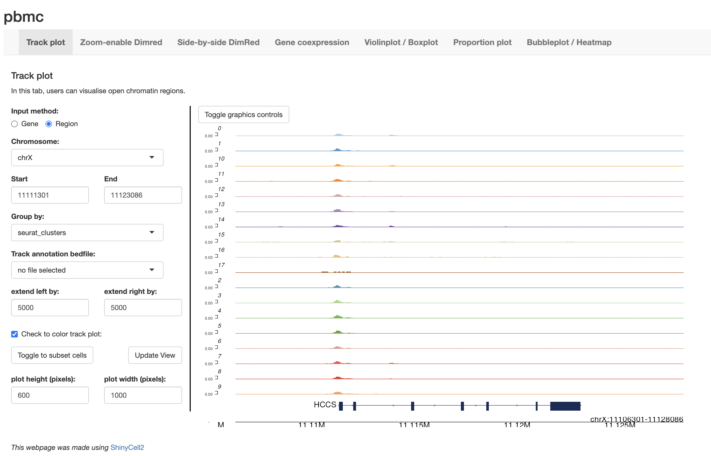

# Introduction
This tutorial guides users on how to create a ShinyCell2 app from a single-cell 
ATAC-seq (scATAC-seq) dataset processed using the Signac pipeline. Signac is an 
R package designed for the analysis of single-cell chromatin accessibility data, 
such as scATAC-seq. It extends the Seurat framework, allowing users to perform 
dimensionality reduction, clustering, integration with gene expression data, and 
visualisation of open chromatin regions at single-cell resolution. 

In this tutorial, we will use an example scATAC-seq dataset of peripheral blood 
mononuclear cells (PBMCs) provided by 10x Genomics which is also used in the 
[Signac tutorial](https://stuartlab.org/signac/articles/pbmc_vignette.html). 
In Signac, fragment information—representing all unique chromatin accessibility 
events across single cells—is stored separately in a fragment file. For this 
tutorial, we provide both the processed Signac object `signac_pbmc.rds` and 
compressed fragment file `signac_pbmc_fragments.tsv.gz`. 

# Importing Seurat-processed standard or CITE-seq data into ShinyCell2
To begin, we will load the required packages and the processed Seurat object. 
We also need to manually set the path to the fragment file associated with the 
peaks assay in the `pbmc` Signac object.

```r
library(Signac)
library(Seurat)

pbmc <- readRDS("signac_pbmc.rds")
pbmc@assays[["peaks"]]@fragments[[1]]@path = "signac_pbmc_fragments.tsv.gz"

```

# Configuring ShinyCell2 for optimal visualisation of spatial scRNA-seq data
Next, we will use the `createConfig()` function to generate a ShinyCell2 config 
object named `scConf`. This object is a data.table that specifies: (i) which 
single-cell metadata to display in the Shiny app, (ii) the ordering of levels 
for categorical metadata (e.g., library or cluster), and (iii) the color palette 
assigned to each metadata variable. Essentially, `scConf` serves as an 
"instruction manual" for defining the aesthetics of the eventual ShinyCell2 app,
without altering the original single-cell data. Here, we removed some metadata 
that we deem redundant using the `delMeta()` function. For more details on how 
to customise the ShinyCell2 config, refer to this 
[Tutorial for customising ShinyCell aesthetics](
https://htmlpreview.github.io/?https://github.com/the-ouyang-lab/ShinyCell2-tutorial/master/docs/aesthetics.html)

```r
scConf <- createConfig(pbmc)
scConf <- delMeta(scConf, "lane")
```

## Create Shiny Files
To generate the ShinyCell2 app, we first run the `makeShinyFiles()` function. 
This function generates the necessary data files (including the single-cell 
metadata and assay etc). For scATAC-seq data, the `bigWigGroup` parameter 
specifies which categorical grouping(s) in the Seurat object's metadata should 
be used to group cells for the generation of BigWig files. These files are used 
in the ShinyCell2 app to display track plots—genome browser-style visualisations 
showing chromatin accessibility across the genome. The main inputs are the 
Signac object `pbmc`, the ShinyCell2 config `scConf`, an unique prefix for the 
dataset specified `shiny.prefix = "sc1"` and the output directory `shiny.dir`. 
Users can also specify the reduced dimensions to include as well as plotting 
defaults. Note that this step can take a substantial amount of time to run as 
the whole dataset is being written in an efficient format for the ShinyCell2 app.

```r
makeShinyFiles(pbmc, bigWigGroup = "seurat_clusters" ,scConf = scConf,
               shiny.prefix = "sc1", shiny.dir = "shinyApp_signac/")
```

## Generate code for Shiny app
Finally, we will generate the code for the ShinyCell2 app using the 
`makeShinyCodes()` function. Here, we specify the same unique prefix 
`shiny.prefix = "sc1"` and output directory shiny.dir. This step should run 
quickly as only the R code scripts are being written.

```r
makeShinyCodes(shiny.prefix = "sc1", 
               shiny.dir = "shinyApp_signac/", 
               shiny.title = "pbmc_CITE-seq")
```
The generated shiny app can then be found in the `shinyApp_signac/` folder. To 
run the app locally, use RStudio to open either server.R or ui.R in the shiny 
app folder and click on “Run App” in the top right corner. The shiny app can 
also be deployed online via online platforms e.g. shinyapps.io and Amazon Web 
Services (AWS) or be hosted via Shiny Server. 

More details on the various visualisations in the ShinyCell2 can be found in 
[Additional information on new visualisations tailored for spatial / scATAC-seq / multiomics](
https://htmlpreview.github.io/?https://github.com/the-ouyang-lab/ShinyCell2-tutorial/master/docs/addNewVis.html) and 
[Additional information on enhanced visualisation features](
https://htmlpreview.github.io/?https://github.com/the-ouyang-lab/ShinyCell2-tutorial/master/docs/addEnhanVis.html)




